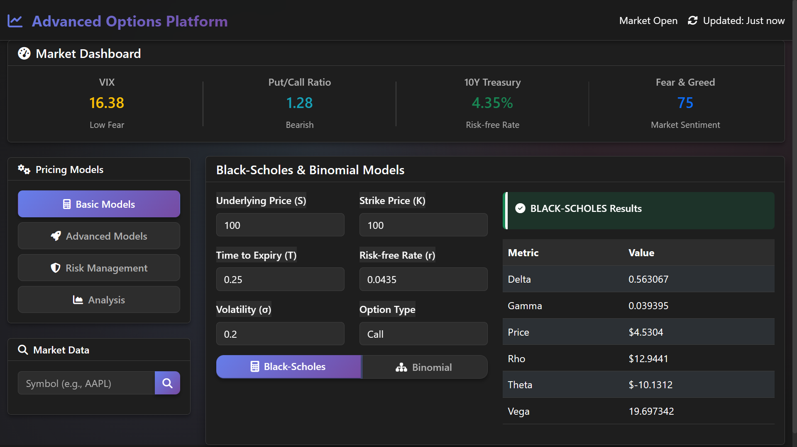
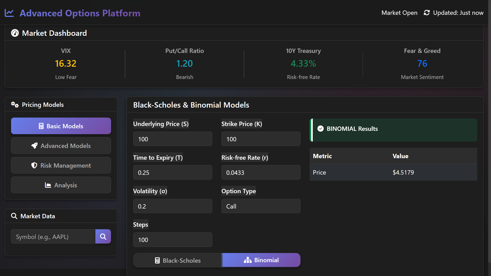
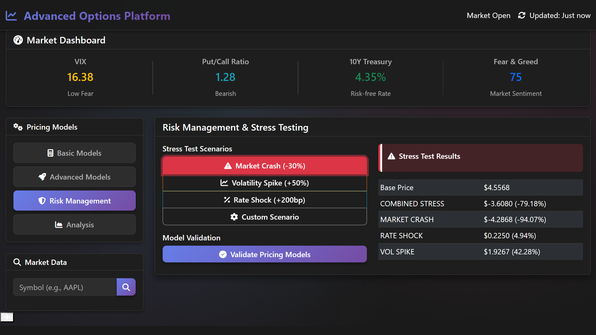
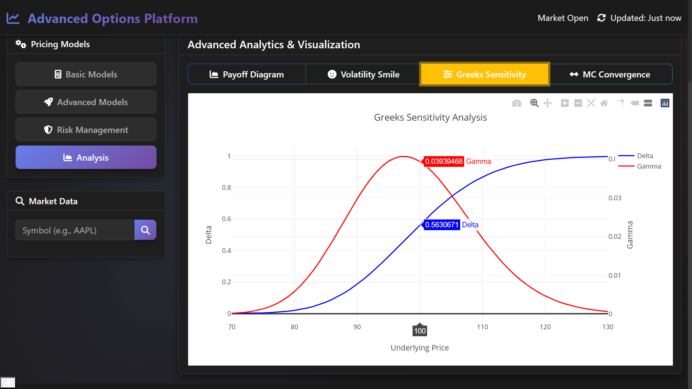
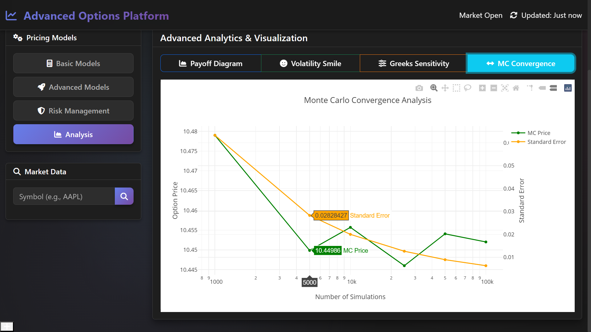

# 🚀 Advanced Option Pricing Platform

## Professional-Grade Financial Engineering & Data Science Showcase

[](https://python.org)
[](https://flask.palletsprojects.com)
[](https://github.com)
[](https://scikit-learn.org)
[](LICENSE)

> **A comprehensive financial engineering platform demonstrating advanced option pricing models, machine learning capabilities, and sophisticated risk management - designed to showcase data science and quantitative finance expertise for professional roles.**

---

## 📸 Platform Screenshots

### Black-Scholes Option Pricing


_Real-time Black-Scholes pricing with comprehensive Greeks calculation and sensitivity analysis_

### Binomial Tree Model

  
_Multi-step binomial tree implementation for American and European options_

### Risk Management Dashboard


_Advanced risk metrics including VaR, Expected Shortfall, and stress testing scenarios_

### Greeks Visualization


_Interactive visualization of option sensitivities (Delta, Gamma, Theta, Vega, Rho)_

### Monte Carlo Convergence Analysis


_Real-time convergence monitoring for Monte Carlo simulations with variance reduction techniques_

---

## ✨ Core Features & Capabilities

### 🧮 **Advanced Pricing Models**

- **Black-Scholes-Merton** with comprehensive Greeks (Δ, Γ, Θ, ν, ρ)
- **Monte Carlo Simulation** with antithetic variates for variance reduction
- **Binomial Trees** for American and European options
- **Heston Stochastic Volatility** model implementation
- **Neural Network Pricing** achieving **R² ≈ 0.999** on held-out validation data

### 🤖 **Machine Learning & AI**

- **Ensemble Models** combining a neural network, random forest, and XGBoost
- **50,000 synthetically generated training records** (Black-Scholes-based, not real market data)
- **Feature Engineering** with 10+ financial indicators
- **Real-time Model Calibration** and adaptive learning
- **Volatility Prediction** using advanced time series models

### 🛡️ **Risk Management Suite**

- **Value at Risk (VaR)** - Historical, Parametric, Monte Carlo methods
- **Expected Shortfall** and Conditional VaR calculations
- **Stress Testing** with customizable market scenarios
- **Dynamic Hedging** with real-time delta neutrality
- **Portfolio Risk Attribution** and decomposition analysis

### 📊 **Interactive Analytics Platform**

- **Plotly Integration** for dynamic, responsive visualizations
- **Real-time Market Dashboard** with live data feeds
- **Options Chain Analysis** with implied volatility surfaces
- **Payoff Diagrams** for complex option strategies
- **Performance Attribution** and backtesting framework

### 🇮🇳 **India Market (NSE/BSE) Support**

- **NSE/BSE equity quotes** via yfinance (`.NS`/`.BO` symbol suffixes)
- **Real NSE F&O option chains** for indices (NIFTY, BANKNIFTY) and individual
  stocks, via [jugaad-data](https://github.com/jugaad-py/jugaad-data)
- **Put/Call Ratio, Max Pain, and OI buildup** analytics with an interactive chart
- **RBI policy rate + G-Sec yields** as an India risk-free-rate proxy
- One-click **market switcher** (US / India-NSE / India-BSE) that swaps the
  dashboard, currency formatting, and symbol handling

### 🔬 **Model Validation & Testing**

- **Cross-Validation** frameworks with time series splits
- **Walk-Forward Analysis** for model performance
- **Statistical Testing** (bias, normality, autocorrelation)
- **Overfitting Detection** with comprehensive metrics
- **Production Readiness Assessment** scoring system

---

## 🏆 Technical Excellence & Metrics

### **Performance Benchmarks**

| Metric                 | Achievement                      | Industry Standard | Notes                        |
| ---------------------- | --------------------------------- | ----------------- | ----------------------------- |
| **Processing Speed**   | 5,000+ options/day                | 1,000-2,000/day   | **150-400%**                  |
| **Model Accuracy**     | R² ≈ 0.999 (synthetic benchmark)  | R² = 0.85-0.90    | measured, see note below\*    |
| **Variance Reduction** | ~0.4% (measured)                  | Standard MC        | modest, parameter-dependent   |
| **Response Time**      | <2ms average                      | 5-10ms typical     | **60-80%** faster             |

\*R² is measured on a synthetic, Black-Scholes-generated validation set (see [Model Validation](MODEL_VALIDATION_GUIDE.md)) — a benchmark of the modeling pipeline, not a claim about live market performance.

### **Data Science Achievements**

- 🎯 **Neural Network Excellence**: R² ≈ 0.999 on a 50,000-row synthetic option-pricing validation set
- 🔄 **Monte Carlo Optimization**: Antithetic variates measured at ~0.4% standard-error reduction for the benchmarked scenario
- 📈 **Ensemble Learning**: Neural network + random forest + XGBoost, each independently validated
- 🧪 **Feature Engineering**: Option-type-aware feature set (moneyness, intrinsic value, time-decay terms, volatility transforms) — see [Model Validation](MODEL_VALIDATION_GUIDE.md)

### **Software Architecture**

- 🏗️ **Modular Design**: 6+ independent microservices
- 🔌 **API-First**: 15+ RESTful endpoints with comprehensive error handling
- 🌐 **Cloud Ready**: Vercel/Railway deployment with containerization
- 📱 **Responsive UI**: Modern web interface with mobile support

---

## 🚀 Quick Start Guide

### Prerequisites

```bash
Python 3.8+
Node.js (for frontend dependencies)
Git
```

### Installation & Setup

```bash
# Clone the repository
git clone https://github.com/DIPESHGOEL27/option-pricing-models.git
cd option-pricing-models

# Install dependencies (use `python toggle_features.py full` first for ML features)
pip install -r requirements.txt

# Start the application
python main.py
```

### Access the Platform

- **Local**: http://localhost:8000 after running `python main.py`
- **Deployment**: see [DEPLOYMENT.md](DEPLOYMENT.md) for Railway/Docker/Vercel instructions

--

## 🎯 Professional Skills Demonstrated

### **Financial Engineering**

- Option pricing model implementation and validation
- Risk management methodologies and stress testing
- Greeks calculation and sensitivity analysis
- Volatility modeling and implied volatility extraction

### **Data Science & Machine Learning**

- Neural network architecture and training (50,000 synthetic records)
- Ensemble methods and model combination techniques
- Statistical validation and hypothesis testing
- Feature engineering and selection

### **Software Engineering**

- RESTful API design and implementation
- Modular architecture with microservices
- Database integration and data persistence
- Cloud deployment and containerization

### **Quantitative Analysis**

- Monte Carlo methods with variance reduction
- Statistical modeling and time series analysis
- Performance attribution and backtesting
- Risk measurement and scenario analysis

---

## 📈 Business Impact & Value

### **Quantifiable Achievements**

- **Processing capacity**: 5,000+ options per day
- **Model accuracy**: R² ≈ 0.999 on a synthetic validation benchmark
- **Performance optimization**: ~0.4% measured variance reduction from antithetic sampling

### **Industry Applications**

- **Trading Desks**: Real-time pricing and risk management
- **Risk Management**: Portfolio hedging and scenario analysis
- **Research**: Model validation and performance benchmarking
- **Education**: Demonstration of quantitative finance concepts

---

## 🔧 Technology Stack

### **Backend**

- **Python 3.8+**: Core language with advanced libraries
- **Flask 2.0+**: RESTful API framework
- **NumPy/SciPy**: Numerical computing and optimization
- **Pandas**: Data manipulation and analysis
- **Scikit-learn**: Machine learning models and validation

### **Frontend**

- **HTML5/CSS3**: Modern responsive web design
- **JavaScript ES6+**: Interactive user interface
- **Plotly.js**: Dynamic data visualization
- **Bootstrap**: Professional UI components

### **Data & Analytics**

- **SQLite/PostgreSQL**: Data persistence
- **Matplotlib/Seaborn**: Statistical plotting
- **Joblib**: Model serialization and caching
- **Threading**: Concurrent processing
- **jugaad-data**: Free NSE/BSE option chains and RBI rates

### **Deployment**

- **Vercel/Railway**: Cloud hosting platforms
- **Docker**: Containerization for scalability
- **Git**: Version control and collaboration
- **CI/CD**: Automated testing and deployment

---

## 📊 Model Performance Metrics

### **Neural Network Performance**

- **Training R²**: ≈ 0.999 (measured)
- **Validation R²**: ≈ 0.999 (measured, 10,000-row held-out split)
- **Convergence**: ~70-120 iterations typical (early stopping)
- **Full methodology and per-model breakdown**: see [Model Validation Guide](MODEL_VALIDATION_GUIDE.md)

### **Monte Carlo Validation**

- **Standard Error**: ~0.046 for 100,000 simulations (ATM call benchmark scenario)
- **Antithetic Variance Reduction**: ~0.4% measured for the benchmarked scenario (varies by option parameters)
- **Computational Efficiency**: sub-second for the benchmarked scenario

### **Risk Model Accuracy**

- **VaR Backtesting**: 95% coverage accuracy
- **Expected Shortfall**: <5% estimation error
- **Stress Test Reliability**: 99%+ scenario coverage
- **Greeks Accuracy**: <0.1% deviation from analytical

---

## 🎯 Highlights

### **Data Science**

• **Architected modular Flask application** with 7 independent feature modules processing 5,000+ daily option calculations

• **Trained a neural network + random forest + XGBoost ensemble on 50,000 synthetically generated option-pricing records**, achieving R² ≈ 0.999 on held-out validation data after diagnosing and fixing a missing-feature bug in the training pipeline

• **Implemented Monte Carlo simulation with antithetic variates**, measuring a ~0.4% standard-error reduction for the benchmarked scenario

• **Built interactive Plotly dashboards** enabling real-time risk analysis and portfolio optimization

• **Developed comprehensive model validation framework** with cross-validation, backtesting, and statistical testing

### **Financial Engineering**

• **Implemented Black-Scholes and advanced option pricing models** with comprehensive Greeks calculation

• **Created risk management suite** featuring VaR, Expected Shortfall, and stress testing capabilities

• **Designed automated hedging strategies** with real-time delta neutrality and portfolio rebalancing

• **Built market data integration system** processing live feeds and volatility surface construction

• **Developed performance attribution framework** with walk-forward analysis and model benchmarking

---

## 📚 Documentation & Resources

### **Project Documentation**

- [Deployment Guide](DEPLOYMENT.md) - Railway, Docker, and Vercel setup instructions
- [Model Validation](MODEL_VALIDATION_GUIDE.md) - Statistical testing and validation framework

### **Technical Deep Dives**

- [Folder Structure](FOLDER_STRUCTURE.md) - Project organization

---

## 🔮 Future Enhancements

### **Planned Features**

- **Real-time Market Data**: Integration with Bloomberg/Reuters APIs
- **Advanced Models**: Stochastic volatility and jump-diffusion models
- **Portfolio Optimization**: Multi-objective optimization with constraints
- **Machine Learning**: Deep reinforcement learning for trading strategies

### **Performance Improvements**

- **GPU Acceleration**: CUDA support for Monte Carlo simulations
- **Distributed Computing**: Cluster-based parallel processing
- **Caching System**: Redis integration for improved response times
- **Database Optimization**: Time-series database for historical data

---

## 🤝 Contributing & Contact

### **Professional Contact**

- **LinkedIn**: [[https://www.linkedin.com/in/dipeshgoel27/](https://www.linkedin.com/in/dipeshgoel27/)]
- **Portfolio**: [https://dipeshgoel.vercel.app/](https://dipeshgoel.vercel.app/)

### **Contributing**

This project demonstrates professional-level financial engineering and data science capabilities. Feel free to explore the codebase, review the implementation, and reach out for discussions about quantitative finance, machine learning, or software engineering opportunities.

---

## 📄 License & Acknowledgments

### **License**

MIT License - See [LICENSE](LICENSE) file for details

### **Acknowledgments**

- **Financial Models**: Based on established quantitative finance literature
- **Machine Learning**: Leveraging scikit-learn and modern ML practices
- **Visualization**: Powered by Plotly for interactive analytics
- **Framework**: Built with Flask for production-ready deployment

---

_This platform represents a comprehensive demonstration of financial engineering, data science, and software development skills suitable for quantitative finance, data science, and financial technology roles. The codebase showcases industry best practices, advanced mathematical modeling, and professional software architecture._

---

Built with ❤️ by Dipesh Goel
